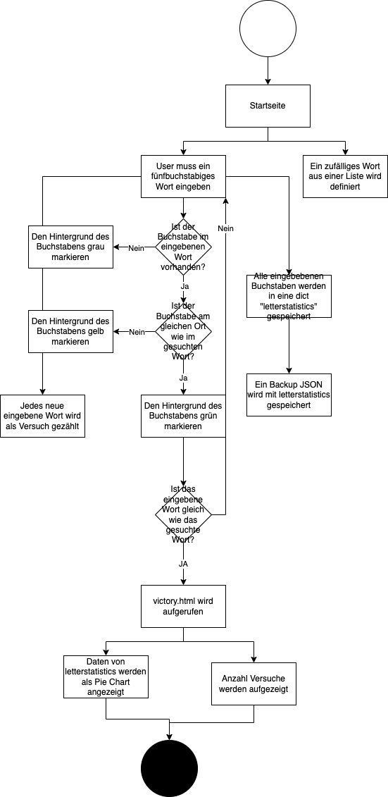

# Woerdli
# Betrieb
Wörldi ist die schweizer Version von dem Original "Wordle".
Gesucht wird ein Wort mit 5 Buchstaben. Gefunden werden kann es durch die Eingabe verschiedener Wörter mit 5 Buchstaben.

# Wie findet man das Wort heraus?
Wenn man ein Wort eingeben hat, wir einem durch die Hintergrundfarbe angedeutet, ob der Buchstabe im Wort vorhanden ist.
- Grau: Wenn der Hintergrund grau bleibt, heisst das, dass der Buchstabe nicht im gesuchten Wort ist.
- Gelb: Wenn der Hintergrund eines Buchstabens gelb wird, bedeutet das, dass der Buchstabe im Wort ist jedoch nicht an der richtigen Stelle.
- Grün: Wird der Huntergrund eines Buchstabens grün, heisst das, dass du der Buchstabe genau richtig ist.

# Wie läuft das Spiel ab?
Man hat unbegrenzt Versuche. Unten hast du eine Anzeige, damit du das Wort einfacher erraten kannst.
Sobald du das richtige Wort eingeben hast, wirst du auf die Gewinnseite weitergeleitet. Da kannst du noch eine Statistik aufrufen. Anhand deren kannst du sehen, welchen Buchstaben du wie viel mal eingeben hast.

# Funktionalität / Flow Chart

# Probleme
Ich persönlich hatte im grossen und ganzen 2 grosse Probleme.

Das erste Problem war, dass ich nicht wusste, wie das Hintergrundbild als eine Variable in Pyhton einbauen konnte. Herr Odoni konnte mir aber das Problem sehr fix erklären und somit wurde das gelöst.

Das zweite Problem war, dass es den Dictionary "letterstatistics" mit jeder neuen Eingabe zurück gesetzt hatte. Dies konnte aber dadurch gelöst weden, das der Dictionary ausserhalb des Dictionarys erstellt wurde.
# Weiterführung
Dieses Programm ist meiner Meinung nach noch lange nicht fertig. Mann könnte mit dem datetime Modul noch einstellen, dass täglich ein neues Wort erscheinen soll. Des weiteren könnte man eine neue Seite erstellen, bei welcher man selber Wörter eingeben kann. Diese würden dann einfach in in die Wortliste in word_processing.py eingefügt werden. 
